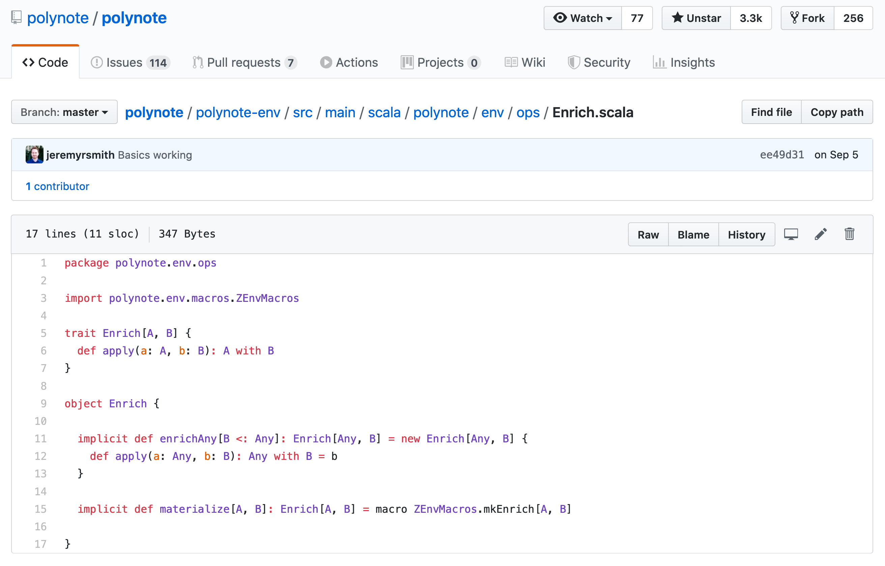

slidenumbers: true

# Macros and __functional effects__
[.slidenumbers: false]
--
--
--
--
--
--
Maxim Schuwalow
Functional Scala, 13.12.2019


---
### Agenda

* Building applications with ZIO
* How can we do better?
* Introducing __zio-macros__


---


---


---


---
##ZIO[__R__, __E__, __A__]

---
## Module Pattern

---
```scala
trait Console extends Serializable {
  val console: Console.Service[Any]
}

object Console extends Serializable {
  trait Service[R] {
    def putStr(line: String): ZIO[R, Nothing, Unit]
    def putStrLn(line: String): ZIO[R, Nothing, Unit]
    val getStrLn: ZIO[R, IOException, String]
  }
}
```

---
```scala
import zio._
import zio.duration._
import zio.console._
import zio.clock._

val useBoth: ZIO[Clock with Console, Nothing, Unit] =
  for {
    _ <- ZIO.sleep(1.second)
    _ <- putStrLn("I waited like a good boy!")
  } yield ()

// bake the cake
val noDeps = ZIO[Any, Nothing, Unit]
  useBoth.provide(new Clock.Live with Console.Live {})
```

---

##Okay,
##let's __build__ stuff...

---
## Application _#1_
--
--
### zio-keeper

---
```scala
trait Env[T] {
  val env: Env.Service[T]
}
object Env {
  trait Service[T] {
    val myself: T
    val activeView: TMap[T, ChunkConnection]
    val passiveView: TSet[T]
    val pickRandom: Int => STM[Nothing, Int]
    val cfg: Config
  }
}
```

---
```scala
trait Transport[T] {
  val transport: Transport.Service[Any, T]
}

object Transport {
  trait Service[R, T] {
    def send(to: T, data: Chunk[Byte]): ZIO[R, TransportError, Unit]
    def connect(to: T): ZIO[R, TransportError, ChunkConnection]
    def bind(addr: T): ZStream[R, TransportError, ChunkConnection]
  }
}
```

---
```scala
def handleJoin[T](
  msg: InitialProtocol.Join[T],
  con: ChunkConnection
): ZIO[Console with Env[T] with Transport[T], Error, Unit] =
  Env.using[T] { env =>
    for {
      others <- env.activeView.keys
                  .map(_.filterNot(_ == msg.sender)).commit
      _      <- ZIO.foreachPar_(others) { node =>
                  send(
                    node,
                    ForwardJoin(
                      env.myself, msg.sender,
                      TimeToLive(env.cfg.arwl)
                    )).ignore }
      _      <- addConnection(msg.sender, con)
    } yield ()
  }
```

---
```scala
object HyParView {
  def apply[R <: Transport[T] with Random with Console with Clock, T](
      localAddr: T,
      activeViewCapactiy: Int,
      passiveViewCapacity: Int,
      arwl: Int,
      prwl: Int,
      shuffleNActive: Int,
      shuffleNPassive: Int,
      shuffleTTL: Int,
      neighborSchedule: Schedule[R, Int, Any],
      shuffleSchedule: Schedule[R, Int, Any]
    ): ZManaged[R, Nothing, Membership[T]] = ???
}
```

---
```scala

type BaseEnv  = ???
type Env      = ???

def withFreshEnv[R <: BaseEnv, E, A](
  zio: ZIO[R with Env, E, A]
): ZIO[R, E, A] = ???
```

---
# 

---
## Application _#2_
--
--
### Every doobie application, ever

---
```scala
type User = ???

trait UserRepository {
  val userRepository: UserRepository[Any]
}

object UserRepository {
  trait Service[R] {
    def addUser(request: CreationRequest): ZIO[R, Nothing, Unit]
    def deleteUser(user: User): ZIO[R, UserNotFound, Unit]
    def getUser(id: UserId): ZIO[R, Nothing, Option[User]]
  }
}
```

---
```scala
  def doobieUserRepository(
    cfg: DBConfig
  ): ZManaged[Blocking, Throwable, UserRepository] =
    ZIO.runtime[Blocking].toManaged_.flatMap { implicit rt =>
      for {
        transactEC <- rt.Environment.blocking.blockingExecutor
                        .map(_.asEC).toManaged_
        connectEC   = rt.Platform.executor.asEC
        transactor <- HikariTransactor
                        .newHikariTransactor[Task](
                          cfg.driver, cfg.url, cfg.user,
                          cfg.password, connectEC,
                          Blocker.liftExecutionContext(transactEC)
                        ).toManaged
      } yield new DoobieUserRepository(transactor)
    }
```

---
```scala
val app: ZIO[UserRepository with Blocking with Console, Nothing, Unit] = ???
val dbConfig: DBConfig = ???

def main(args: List[String]) = {
  for {
    baseEnv               <- ZIO.environment[ZEnv]
    userRepository0       <- doobieUserRepository(dbConfig).provide(env)
    env = new UserRepository with Blocking with Console {
      val userRepository  = userRepository0.userRepository
      val blocking        = env.blocking
      val console         = env.console
    }
    _ <- app.provide(env)
  } yield ()
}
```

---
## Application _#3_
--
--
# 

---
```scala
trait Schedule[-R, -A, +B] {

  final def delayedMEnv[R1 <: Clock](
    f: Duration => ZIO[R1, Nothing, Duration],
    g: (Clock.Service[Any] => Clock.Service[Any]) => R1 => R
  ): Schedule[R1, A, B] = ???

}
```

---
## Requirements
1. Combinations of _R_ are fully inferred   
2. Use larger _R_ instead of smaller _R_    
3. (Effectfully) add members to _R_         
4. (Effectfully) replace members in _R_     

---
## Introducing zio-macros

sbt:

```scala
libraryDependencies += ("dev.zio" %% "zio-macros-core" % "0.6.0")
```

---
### (A, B) => A __with__ B

---
## Mix[__A__, __B__]

```scala
trait Mix[A, B] {

  def mix(a: A, b: B): A with B
}

object Mix {

  def apply[A, B](implicit ev: Mix[A, B]) = ev

  implicit def deriveMix[A, B]: Mix[A, B] =
    macro Macros.mixImpl[A, B]
}
```

---
```scala
class Foo {
  def foo: Int = 2
}

trait Bar {
  def bar: Int
}

def withBar[A](a: A)(implicit ev: Mix[A, Bar]): A with Bar =
  ev.mix(a, new Bar { def bar = 2 })

withBar(new Foo()).bar // 2
```

---
## EnrichWith

```scala
def enrichWith[A](a: A): EnrichWith[A] =
  new EnrichWith(a)

def enrichWithM[A]: EnrichWithM.PartiallyApplied[A] =
  new EnrichWithM.PartiallyApplied

def enrichWithManaged[A]: EnrichWithManaged.PartiallyApplied[A] =
  new EnrichWithManaged.PartiallyApplied
```

---
```scala
final class EnrichWithM[-R, +E, B](val zio: ZIO[R, E, B]) {
  ???

  def enrichZIO[R1, E1 >: E, A <: R](
    that: ZIO[R1, E1, A]
  )(implicit ev: A Mix B): ZIO[R1, E1, A with B] =
    that.flatMap(r1 => zio.provide(r1).map(ev.mix(r1, _)))
}

object EnrichWithM {
  final class PartiallyApplied[A] {
    def apply[R, E](zio: ZIO[R, E, A]): EnrichWithM[R, E, A] =
      new EnrichWithM(zio)
  }
}
```

---
```scala
val enrichClock =
  enrichWith[Clock](Clock.Live)

val enrichClockM =
  enrichWithM[Clock](ZIO.succeed(Clock.Live))

val enrichClockManaged =
  enrichWithManaged[Clock](ZManaged.succeed(Clock.Live))
```

---
```scala
val blockingWithDeps: ZIO[Console, Throwable, Blocking] =
  ZIO.succeed(Blocking.Live)

val enrichBlockingMWithDeps =
  enrichWithM[Blocking](blockingWithDeps)
```


---
```scala
implicit class ZIOOps[R, E, A](zio: ZIO[R, E, A]) {

  def @@[B](
    enrichWith: EnrichWith[B]
  )(implicit ev: A Mix B): ZIO[R, E, A with B] =
    enrichWith.enrichZIO[R, E, A](zio)

}
```

---
```scala
val enrichClock = enrichWith[Clock](Clock.Live)

val blockingWithDeps: ZIO[Console, Throwable, Blocking] =
  ZIO.succeed(Blocking.Live)

val enrichBlockingMWithDeps =
  enrichWithM[Blocking](blockingWithDeps)

//=====================================================================

val randomWithClock: ZIO[Any, Nothing, Random with Clock] =
  ZIO.succeed(Random.Live) @@ enrichClock

val consoleWithBlocking: ZIO[Console, Nothing, Console with Blocking] =
  ZIO.environment[Console] @@ enrichBlockingMWithDeps
```

---
```scala
object Main extends zio.ManagedApp {

  def main(args: List[String]) =
    ZIO.environment[ZEnv]                  @@
    withSlf4jLogger                        @@
    withDoobieTodoRepository(cfg.dbConfig) @@
    withDefaultTracing                     >>>
    runHttp(httpApp, cfg.appConfig.port).toManaged_

}
```

---
## Coming soon:
### Object-oriented optics

---
## Patch

```scala
def patch[A, B](
  implicit ev: A Mix B
): (B => B) => A with B => A with B =
  f => old => ev.mix(old, f(old))
```

---
## Patch

```scala
def patch[A, B](
  implicit ev: A Mix B
): (B => B) => A with B => A with B =
  f => old => ev.mix(old, f(old))

val mapClock: (Clock.Service[Any] => Clock.Service[Any]) => ZEnv => ZEnv =
  f => patch[ZEnv, Clock].apply(c => new Clock { val clock = f(c.clock) })

def disableLogging[R <: ZLogger: Mix[?, ZLogger], E, A](
  zio: ZIO[R, E, A]
): ZIO[R, E, A] =
  ZIO.provideSome[R](env => patch[R, ZLogger](_ => NoOpLogger)(env))
```

---
## Local elimination

---
```scala
val zio: ZIO[Clock with Blocking, Nothing, Unit] = ???

val zioEliminated: ZIO[Blocking, Nothing, Unit] =
  zio.providePart[Clock](Clock.Live)


val zManaged: ZManaged[Clock with Blocking, Nothing, Unit] = ???

val zManagedEliminated: ZManaged[Blocking, Nothing, Unit] =
  zManaged.providePart[Clock](Clock.Live)
```

---
## Polynote

---


---
### Is this __magic__?

---


---
## Thank __you__!
